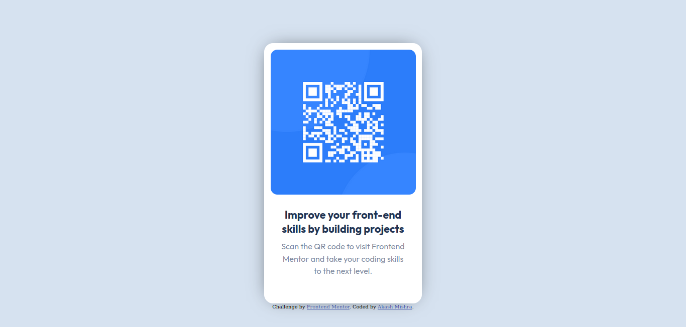
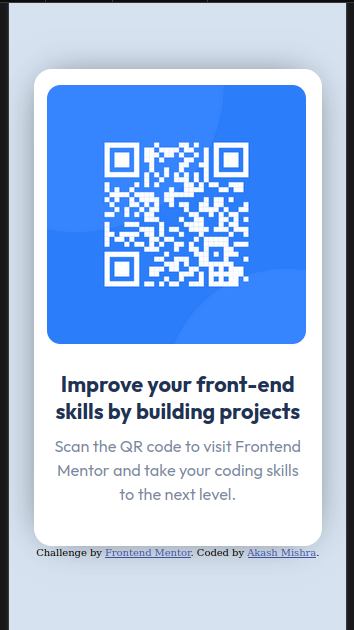

# FrontendMentor

# Frontend Mentor - QR code component

# Frontend Mentor - QR code component solution

This is a solution to the [QR code component challenge on Frontend Mentor](https://www.frontendmentor.io/challenges/qr-code-component-iux_sIO_H). Frontend Mentor challenges help you improve your coding skills by building realistic projects.

## Table of contents

- [Overview](#overview)
  - [Screenshot](#screenshot)
  - [Links](#links)
- [My process](#my-process)
  - [Built with](#built-with)
  - [What I learned](#what-i-learned)
  - [Useful resources](#useful-resources)
- [Author](#author)

## Overview

### Screenshot

Here is the desktop-view

Here is the mobile-view

### Links

- Solution URL: [Click here](https://github.com/akashmishrahaha/FrontendMentor.git)
- Live Site URL: [Click here](https://your-live-site-url.com)

## My process

I started with core HTML5, with the help of building blocks like div. Then I started applying CSS on each element.

### Built with

- Semantic HTML5 markup
- CSS custom properties
- Mobile-first workflow

### What I learned

I learned about a lot of CSS properties specially related to responsiveness.

### Useful resources

- [Example resource 1](https://www.frontendmentor.io/learning-paths/getting-started-on-frontend-mentor-XJhRWRREZd/steps/66368e8b20fb35b1b6be852e/article/read) - This helped me for uploading the file. I really liked this pattern and will use it going forward.
- [Example resource 2](https://web.dev/learn/design) - This is an amazing article which helped me finally understand how to make responsive website. I'd recommend it to anyone still learning this concept.

## Author

- Website - [Akash Mishra](https://www.linkedin.com/in/akashmishrahaha/)
- Frontend Mentor - [@akashmishrahaha](https://www.frontendmentor.io/profile/akashmishrahaha)
- Twitter - [akashmishrahaha](https://twitter.com/akashmishrahaha)
